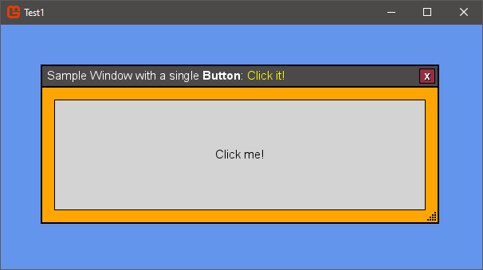

# MGUI

MGUI is a UI framework for [MonoGame](https://www.monogame.net/) that features a powerful layout engine similar to WPF, and a robust set of controls to build your UI with. 

Most of the controls have similar names to what you would expect from WPF, except their class names are prefixed with 'MG'. Currently supported controls:
- 'Container'-like Controls that define their own logic for arranging their children:
  - MGDockPanel
  - MGGrid
  - MGOverlayPanel
  - MGStackPanel
- Controls that can have child Content:
  - MGBorder
  - MGButton
  - MGCheckBox
  - MGComboBox
  - MGContextMenu
  - MGContextMenuItem
  - MGContentPresenter
  - MGExpander
  - MGGroupBox
  - MGListView
  - MGRadioButton
  - MGScrollViewer
  - MGSpoiler
  - MGTabControl
  - MGToggleButton
  - MGTabItem
  - MGToolTip
  - MGWindow
- Controls that cannot have child Content:
  - MGGridSplitter
  - MGImage
  - MGPasswordBox
  - MGProgressBar
  - MGRatingControl
  - MGRectangle
  - MGResizeGrip
  - MGSeparator
  - MGSpacer
  - MGSlider
  - MGStopwatch
  - MGTextBlock
  - MGTextBox
  - MGTimer
  
# Getting Started

Note: MGUI.Core currently targets net6.0-windows. Why Windows only? Because a small chunk of the codebase uses System.Xaml.Xamlservices.Parse to parse XAML strings, which is unavailable in .net core. XAML strings provide a convenient way to define your UI, but everything that can be done in XAML can also be done with c# code. So if your Game targets an OS other than windows, you (probably, un-tested) still can use MGUI, but you'll need to set MGUI.Core project's Target OS to (None) and remove the classes that reference System.Xaml (namely everything in MGUI.Core.UI.XAML folder.

# To use MGUI:

1. Clone this repo
2. Use Visual Studio 2022 (since this project targets .NET 6.0, and makes use of some new-ish C# language features such as record structs)
3. In your MonoGame project:
   - In the Solution Explorer:
     - Right-click your Solution, *Add* -> *Existing Project*. Browse for *MGUI.Shared.csproj*, and *MGUI.Core.csproj*.
     - Right-click your Project, *Add* -> *Project Reference*. Add references to *MGUI.Shared and MGUI.Core*.
     - You may need to:
       - Right-click your game's *Content* folder, *Add* -> *Existing Item*. Browse for *MGUI\MGUI.Shared\Content\MGUI.Shared.Content.mgcb* and *MGUI\MGUI.Core\Content\MGUI.Core.Content.mgcb* and add them both as links (in the file browser dialog, click the dropdown arrow next to the *Add* button and choose *Add as link*. This is intended to ensure MGUI's content .xnb files are copied to your project's bin\Content folder. This step might not be necessary.
   - In your Game class:
     - In the Initialize method:
       - Instantiate *MGUI.Shared.Rendering.MainRenderer*
         - This class requires an *IRenderHost*, which is typically created via an instance of *MGUI.Shared.Rendering.GameRenderHost*
       - Instantiate *MGUI.Core.UI.MGDesktop*
         - An *MGDesktop* represents the screen bounds that you can add your UI to. You probably only ever need 1 instance of *MGDesktop*, and can add all your *MGWindows* to it.
     - Anywhere in your code, instantiate 1 or more *MGWindow* and add them to your *MGDesktop* instance via the *MGDesktop.Windows* list.
     - In the Update method: Call *MGDesktop.Update*
     - In the Draw method: Call *MGDesktop.Draw
      
<details>
  <summary>Example code for your Game class:</summary>

```c#
public class Game1 : Game, IObservableUpdate
{
    private GraphicsDeviceManager _graphics;
    private SpriteBatch _spriteBatch;

    private MainRenderer MGUIRenderer { get; set; }
    private MGDesktop Desktop { get; set; }

    public event EventHandler<TimeSpan> PreviewUpdate;
    public event EventHandler<EventArgs> EndUpdate;

    public Game1()
    {
        _graphics = new GraphicsDeviceManager(this);
        Content.RootDirectory = "Content";
        IsMouseVisible = true;
        Window.AllowUserResizing = true;
    }

    protected override void Initialize()
    {
        this.MGUIRenderer = new(new GameRenderHost<Game1>(this));
        this.Desktop = new(MGUIRenderer);

        MGWindow Window1 = new(Desktop, 50, 50, 500, 200);
        Window1.TitleText = "Sample Window with a single [b]Button[/b]: [color=yellow]Click it![/color]";
        Window1.BackgroundBrush.NormalValue = new MGSolidFillBrush(Color.Orange);
        Window1.Padding = new(15);
        MGButton Button1 = new(Window1, x => { x.SetContent("I've been clicked!"); });
        Button1.SetContent("Click me!");
        Window1.SetContent(Button1);

        this.Desktop.Windows.Add(Window1);

        // TODO: Add your initialization logic here

        base.Initialize();
    }

    protected override void LoadContent()
    {
        _spriteBatch = new SpriteBatch(GraphicsDevice);

        // TODO: use this.Content to load your game content here
    }

    protected override void Update(GameTime gameTime)
    {
        if (GamePad.GetState(PlayerIndex.One).Buttons.Back == ButtonState.Pressed || Keyboard.GetState().IsKeyDown(Keys.Escape))
            Exit();

        PreviewUpdate?.Invoke(this, gameTime.ElapsedGameTime);

        Desktop.Update();
        // TODO: Add your update logic here

        base.Update(gameTime);

        EndUpdate?.Invoke(this, EventArgs.Empty);
    }

    protected override void Draw(GameTime gameTime)
    {
        GraphicsDevice.Clear(Color.CornflowerBlue);

        // TODO: Add your drawing code here

        Desktop.Draw();

        base.Draw(gameTime);
    }
}
```


</details>


